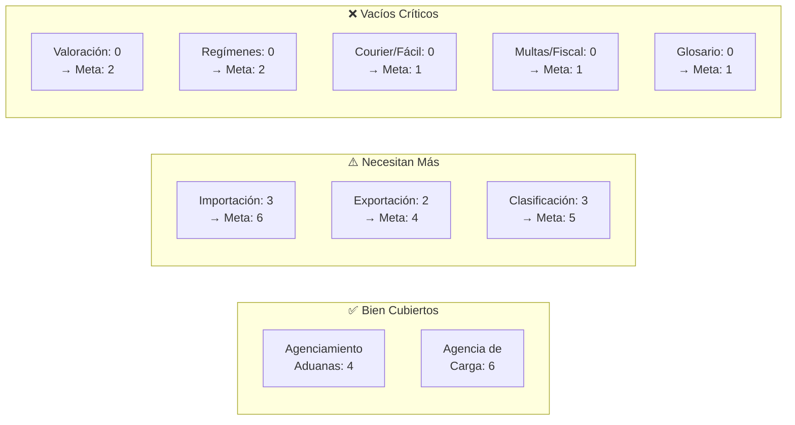

# Auditoría de Blog AduanasPE + Estrategia SEO

## 1. Inventario de Artículos Existentes (20 posts)

### Cluster: Agenciamiento Aduanero (4 posts)
| # | Artículo | Tipo SEO | Fecha |
|---|----------|----------|-------|
| 1 | [todo-sobre-agencias-de-aduanas](file:///c:/Users/Gualbert/apps/aduanaspe/src/content/blog/todo-sobre-agencias-de-aduanas.mdx) | **Pilar** (cornerstone) | 2025-01-05 |
| 2 | [7-razones-agencias-aduanas-peru-socios-estrategicos](file:///c:/Users/Gualbert/apps/aduanaspe/src/content/blog/7-razones-agencias-aduanas-peru-socios-estrategicos.mdx) | **Listicle** persuasivo | 2025-02-15 |
| 3 | [registrar-mandato-electronico-sunat](file:///c:/Users/Gualbert/apps/aduanaspe/src/content/blog/registrar-mandato-electronico-sunat.mdx) | **Tutorial** paso a paso | 2025-02-28 |
| 4 | [guia-inspeccion-no-intrusiva-puertos-2024](file:///c:/Users/Gualbert/apps/aduanaspe/src/content/blog/guia-inspeccion-no-intrusiva-puertos-2024.mdx) | **Guía** técnica | 2025-04-01 |

### Cluster: Agencia de Carga / Logística (6 posts)
| # | Artículo | Tipo SEO | Fecha |
|---|----------|----------|-------|
| 5 | [transporte-maritimo-internacional-cotizacion-fletes-gestion-contenedores](file:///c:/Users/Gualbert/apps/aduanaspe/src/content/blog/transporte-maritimo-internacional-cotizacion-fletes-gestion-contenedores.mdx) | **Pilar** (cornerstone) | 2025-01-10 |
| 6 | [que-es-una-agencia-de-carga-internacional](file:///c:/Users/Gualbert/apps/aduanaspe/src/content/blog/que-es-una-agencia-de-carga-internacional.mdx) | **Pilar** informativo | 2025-01-15 |
| 7 | [7-claves-flete-falso-flete-guia-esencial](file:///c:/Users/Gualbert/apps/aduanaspe/src/content/blog/7-claves-flete-falso-flete-guia-esencial.mdx) | **Listicle** técnico | 2025-01-20 |
| 8 | [como-crear-una-agencia-de-carga](file:///c:/Users/Gualbert/apps/aduanaspe/src/content/blog/como-crear-una-agencia-de-carga.mdx) | **Guía** emprendimiento | 2025-06-10 |
| 9 | [estado-actual-de-agentes-de-carga](file:///c:/Users/Gualbert/apps/aduanaspe/src/content/blog/estado-actual-de-agentes-de-carga.mdx) | **Análisis** sectorial | 2025-06-15 |
| 10 | [servicios-clave-agencia-de-cargas](file:///c:/Users/Gualbert/apps/aduanaspe/src/content/blog/servicios-clave-agencia-de-cargas.mdx) | **Listicle** de servicios | 2025-06-25 |

### Cluster: Importación (3 posts)
| # | Artículo | Tipo SEO | Fecha |
|---|----------|----------|-------|
| 11 | [importar-de-china-a-peru](file:///c:/Users/Gualbert/apps/aduanaspe/src/content/blog/importar-de-china-a-peru.mdx) | **Pilar** (cornerstone) | 2025-03-10 |
| 12 | [5-asombrosas-claves-importar-productos-digitales-sin-pagar-impuestos](file:///c:/Users/Gualbert/apps/aduanaspe/src/content/blog/5-asombrosas-claves-importar-productos-digitales-sin-pagar-impuestos.mdx) | **Listicle** nicho | 2025-03-20 |
| 13 | [importaciones-implementos-seguridad-peru-mayo-2025](file:///c:/Users/Gualbert/apps/aduanaspe/src/content/blog/importaciones-implementos-seguridad-peru-mayo-2025.mdx) | **Guía** sectorial | 2025-05-15 |

### Cluster: Exportación (2 posts)
| # | Artículo | Tipo SEO | Fecha |
|---|----------|----------|-------|
| 14 | [exportaciones-quinua-mayo-2025](file:///c:/Users/Gualbert/apps/aduanaspe/src/content/blog/exportaciones-quinua-mayo-2025.mdx) | **Caso** de producto | 2025-05-20 |
| 15 | [notificacion-de-salida-de-mercancias](file:///c:/Users/Gualbert/apps/aduanaspe/src/content/blog/notificacion-de-salida-de-mercancias.mdx) | **Tutorial** técnico | 2025-07-10 |

### Cluster: Clasificación Arancelaria (3 posts)
| # | Artículo | Tipo SEO | Fecha |
|---|----------|----------|-------|
| 16 | [clasificacion-arancelaria-galaxy-buds3](file:///c:/Users/Gualbert/apps/aduanaspe/src/content/blog/clasificacion-arancelaria-galaxy-buds3.mdx) | **Caso práctico** | 2025-04-15 |
| 17 | [clasificacion-arancelaria-cesto-ratan](file:///c:/Users/Gualbert/apps/aduanaspe/src/content/blog/clasificacion-arancelaria-cesto-ratan.mdx) | **Caso práctico** | 2025-07-20 |
| 18 | [clasificacion-arancelaria-galaxy-buds-fe-sm-r400](file:///c:/Users/Gualbert/apps/aduanaspe/src/content/blog/clasificacion-arancelaria-galaxy-buds-fe-sm-r400.mdx) | **Caso práctico** | 2025-07-25 |

### Cluster: Comercio Exterior General (1 post)
| # | Artículo | Tipo SEO | Fecha |
|---|----------|----------|-------|
| 19 | [acreditacion-medios-de-pago-comercio-internacional](file:///c:/Users/Gualbert/apps/aduanaspe/src/content/blog/acreditacion-medios-de-pago-comercio-internacional.mdx) | **Guía** comparativa | 2025-02-15 |

### Cluster: Operador Logístico (1 post)
| # | Artículo | Tipo SEO | Fecha |
|---|----------|----------|-------|
| 20 | [operador-logistico-cadena-suministro-post-covid](file:///c:/Users/Gualbert/apps/aduanaspe/src/content/blog/operador-logistico-cadena-suministro-post-covid.mdx) | **Análisis** tendencias | 2025-07-05 |

---

## 2. Tipos de Artículos SEO (Taxonomía)

Cada tipo de artículo tiene un propósito diferente en la estrategia SEO:

### 🏛️ Artículo Pilar (Cornerstone / Pillar Page)
- **Qué es**: Guía exhaustiva (2000+ palabras) sobre un tema amplio
- **Objetivo SEO**: Rankear para keywords de alto volumen, head terms
- **Intención de búsqueda**: Informativa amplia
- **Ejemplo tuyo**: *"Todo sobre Agencias de Aduanas"*, *"Importar de China a Perú"*
- **Tienes**: ✅ 4 pilares — **Faltan pilares para Exportación y Clasificación Arancelaria**

### 📋 Listicle (Artículo de Lista)
- **Qué es**: Contenido organizado en lista numerada ("7 claves...", "5 razones...")
- **Objetivo SEO**: CTR alto en SERP, snippets destacados
- **Intención**: Informativa/Comercial
- **Ejemplo tuyo**: *"7 Claves sobre Flete y Falso Flete"*, *"7 Razones Agencias de Aduanas"*
- **Tienes**: ✅ 4 listicles — Buen balance

### 📖 Tutorial / Guía Paso a Paso (How-To)
- **Qué es**: Instrucciones secuenciales para resolver un problema específico
- **Objetivo SEO**: Featured snippets, People Also Ask, búsquedas "cómo..."
- **Intención**: Informativa/Transaccional
- **Ejemplo tuyo**: *"Cómo Registrar el Mandato Electrónico"*, *"Cómo Importar de China"*
- **Tienes**: ✅ 3 tutoriales — **Falta uno de exportación y uno de valoración aduanera**

### 🔍 Caso Práctico (Case Study / Ejemplo Real)
- **Qué es**: Análisis de un caso específico que demuestra expertise
- **Objetivo SEO**: Long-tail keywords muy específicas, E-E-A-T (experiencia)
- **Intención**: Informativa técnica
- **Ejemplo tuyo**: *"Clasificación Arancelaria Galaxy Buds3"*, *"Clasificación Cesto Ratán"*
- **Tienes**: ✅ 3 casos — **Gran oportunidad de expandir a más productos populares**

### 📊 Análisis Sectorial / Data-Driven
- **Qué es**: Artículo con datos, estadísticas y análisis de tendencias
- **Objetivo SEO**: Backlinks naturales (sitios citan tus datos), autoridad temática
- **Intención**: Investigación comercial
- **Ejemplo tuyo**: *"Panorama Agentes de Carga 2025"*, *"Exportaciones de Quinua"*
- **Tienes**: ✅ 2 análisis — **Falta uno de importaciones Perú y uno de comercio bilateral**

### ⚖️ Artículo Comparativo (Versus / Comparativa)
- **Qué es**: Compara dos opciones que el usuario está evaluando
- **Objetivo SEO**: Búsquedas comerciales "X vs Y", decisión de compra
- **Intención**: Comercial/Transaccional
- **Ejemplo tuyo**: *"Medios de Pago en Comercio Internacional"* (parcialmente)
- **Tienes**: ⚠️ 1 parcial — **GAP significativo. Este tipo convierte muy bien**

### ❓ FAQ / Glosario
- **Qué es**: Respuestas a preguntas frecuentes o definición de términos
- **Objetivo SEO**: Featured snippets, "People Also Ask", voice search
- **Intención**: Informativa básica
- **Tienes**: ❌ **0 artículos FAQ/Glosario — GAP crítico**

### 📰 Noticia / Actualización Normativa
- **Qué es**: Artículo corto sobre un cambio regulatorio o evento reciente
- **Objetivo SEO**: Tráfico de actualidad, freshness signal para Google
- **Intención**: Informativa urgente
- **Tienes**: ❌ **0 artículos de actualización normativa — GAP importante**

---

## 3. Análisis de Gaps (Brechas)

### Gaps por Topic

| Topic | Posts Actuales | Evaluación |
|-------|--------------|------------|
| Agenciamiento Aduanas | 4 | ✅ Bien cubierto |
| Agencia de Carga | 6 | ✅ Saturado (reducir ritmo) |
| Importación | 3 | ⚠️ Falta más segmentación por producto/país |
| Exportación | 2 | ❌ **Subrepresentado** — Solo quinua + técnico |
| Clasificación Arancelaria | 3 | ⚠️ Solo electrónica y cestería |
| Valoración Aduanera | 0 | ❌ **Vacío total** |
| Regímenes Aduaneros | 0 | ❌ **Vacío total** (drawback, admisión temporal, etc.) |
| Courier / Importa Fácil | 0 | ❌ **Vacío total** — Keyword de alto volumen |
| Fiscalización/Multas | 0 | ❌ **Vacío total** — Alto interés del usuario |
| Resguardo Aduanero | 0 | ❌ **No hay artículo** para este servicio clave |

### Gaps por Tipo de Artículo

| Tipo SEO | Cantidad | Gap |
|----------|----------|-----|
| Pilar | 4 | Falta exportación, clasificación |
| Listicle | 4 | OK |
| Tutorial | 3 | Falta exportación, valoración |
| Caso práctico | 3 | Expandir a productos populares |
| Análisis sectorial | 2 | Falta data de importaciones |
| Comparativo (vs) | 1 parcial | ❌ Gap crítico |
| FAQ/Glosario | 0 | ❌ Gap crítico |
| Noticia normativa | 0 | ❌ Gap importante |

### Gaps por Intención de Búsqueda

| Intención | Cobertura | Problema |
|-----------|-----------|----------|
| **Informativa** | ✅ Alta | Bien cubierta |
| **Comercial** | ⚠️ Media | Faltan comparativas y decisión |
| **Transaccional** | ❌ Baja | No hay artículos que lleven directamente al servicio |
| **Navegacional** | N/A | Páginas de servicio cubren esto |

---

## 4. Próximos Artículos Recomendados (20)

### 🔴 Fase 1: Alta Prioridad (llenar gaps críticos)

| # | Título Propuesto | Tipo SEO | Keyword Principal | Intención |
|---|-----------------|----------|-------------------|-----------|
| 1 | **"Glosario de Comercio Exterior y Aduanas 2025"** | FAQ/Glosario | *glosario comercio exterior*, *términos aduaneros* | Informativa |
| 2 | **"Cómo Exportar desde Perú: Guía Completa para Nuevos Exportadores"** | Pilar | *cómo exportar desde perú*, *exportar perú* | Informativa |
| 3 | **"Valoración Aduanera en Perú: Métodos, Cálculo y Errores Comunes"** | Pilar | *valoración aduanera perú*, *valor CIF aduanas* | Informativa |
| 4 | **"Regímenes Aduaneros en Perú: Cuál Conviene para tu Operación"** | Comparativo | *regímenes aduaneros perú*, *admisión temporal*, *drawback* | Comercial |
| 5 | **"Importar por Courier vs Carga Formal: ¿Cuál te Conviene?"** | Comparativo | *importar por courier perú*, *importa fácil*, *envíos rápidos* | Comercial |
| 6 | **"Multas Aduaneras SUNAT: Tabla Completa y Cómo Evitarlas"** | Guía | *multas sunat aduanas*, *infracciones aduaneras perú* | Informativa |
| 7 | **"Resguardo Aduanero: Qué Es y Por Qué Protege tu Inversión"** | Pilar servicio | *resguardo aduanero*, *custodia de mercancía* | Comercial |

> [!IMPORTANT]
> Los artículos 1-7 llenan vacíos temáticos críticos. El **Glosario** es un imán de backlinks. El artículo sobre **exportación** duplicaría tu cobertura de un topic con solo 2 posts. **Valoración aduanera** y **multas** son búsquedas de altísimo interés en el sector.

---

### 🟡 Fase 2: Prioridad Media (expandir clusters y diversificar)

| # | Título Propuesto | Tipo SEO | Keyword Principal | Intención |
|---|-----------------|----------|-------------------|-----------|
| 8 | **"Drawback en Perú: Requisitos, Cálculo y Paso a Paso para Recuperar tu 3%"** | Tutorial | *drawback perú*, *restitución derechos arancelarios* | Transaccional |
| 9 | **"Importar Ropa y Textiles de China a Perú: Aranceles, Antidumping y Requisitos"** | Guía sectorial | *importar ropa china perú*, *antidumping textiles* | Informativa |
| 10 | **"Clasificación Arancelaria de Maquinaria Industrial (Caso Práctico)"** | Caso práctico | *clasificación arancelaria maquinaria*, *partida arancelaria* | Informativa |
| 11 | **"Agente de Aduanas vs Agencia de Carga: Diferencias y Cuándo Necesitas Cada Uno"** | Comparativo | *agente de aduanas vs agencia de carga* | Comercial |
| 12 | **"Puerto de Chancay 2025: Impacto en Importaciones y Nuevas Oportunidades"** | Análisis sectorial | *puerto chancay*, *megapuerto chancay importaciones* | Investigación |
| 13 | **"Cómo Calcular los Tributos de Importación en Perú (con Ejemplos Reales)"** | Tutorial | *calcular tributos importación perú*, *cuánto pago de impuestos* | Informativa |
| 14 | **"Exportar Café desde Perú: Guía de Requisitos, Mercados y Logística"** | Caso producto | *exportar café perú*, *requisitos exportación café* | Informativa |

> [!TIP]
> El artículo 11 (agente vs agencia) conecta tus dos pilares de servicios. El artículo 12 (Chancay) captura tráfico de actualidad. Los artículos 9 y 14 segmentan por producto para captar long-tail keywords muy específicas.

---

### 🟢 Fase 3: Expansión (autoridad temática completa)

| # | Título Propuesto | Tipo SEO | Keyword Principal | Intención |
|---|-----------------|----------|-------------------|-----------|
| 15 | **"Certificado de Origen: Tipos, Cómo Obtenerlo y Ahorro Real en Aranceles"** | Tutorial | *certificado de origen perú*, *TLC perú* | Informativa |
| 16 | **"DUA / DAM Explicada: Campos, Errores Comunes y Cómo Leerla"** | Tutorial técnico | *DUA aduanas perú*, *DAM declaración aduanera* | Informativa |
| 17 | **"Importar de USA a Perú: Guía 2025 con Costos y TLC"** | Guía país | *importar de estados unidos a perú*, *importar usa perú* | Informativa |
| 18 | **"Clasificación Arancelaria de Suplementos y Vitaminas (Caso DIGESA)"** | Caso práctico | *importar suplementos perú*, *clasificar vitaminas aduanas* | Informativa |
| 19 | **"Seguro de Carga Internacional: Tipos, Cobertura y Cuánto Cuesta"** | Guía comparativa | *seguro de carga internacional*, *seguro transporte* | Comercial |
| 20 | **"Operador Económico Autorizado (OEA) en Perú: Beneficios y Requisitos"** | Guía | *OEA perú*, *operador económico autorizado sunat* | Informativa |

---

## 5. Resumen Visual: Cobertura Actual vs Meta

## 6. Distribución Ideal por Tipo SEO (próximos 20)

| Tipo SEO | Actuales | Próximos | Total Meta |
|----------|----------|----------|------------|
| Pilar | 4 | 3 | 7 |
| Tutorial | 3 | 4 | 7 |
| Caso práctico | 3 | 2 | 5 |
| Comparativo | 1 | 3 | 4 |
| Guía sectorial | 3 | 4 | 7 |
| Análisis/Data | 2 | 1 | 3 |
| FAQ/Glosario | 0 | 1 | 1 |
| Noticia normativa | 0 | 2+ | 2+ |
